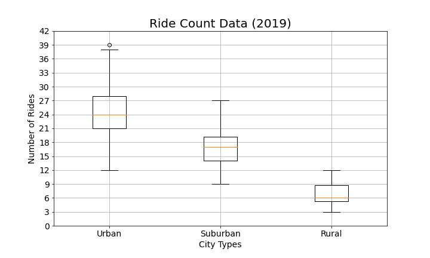
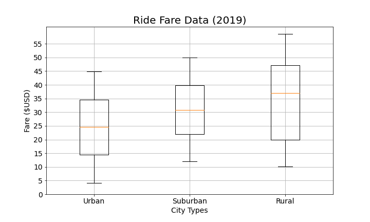

# PyBer_Analysis

## Overview and Purpose 

The purpose of this analysis was to summarize the data for a ride share company called "Pyber" for specific weeks and city types. The data pulled and examined was centered around the cost of the rides (fares), the number of rides per day, and number of drivers in rural, suburban, and urban city types for all dates. We will examine the aesthetically pleasing figures the below to furthur discuss the differences between the city types in the three categories. Pyber also requested to look at the weeks from Jan. 1st to April 29th to see how fares changed over time based on each city type. 

## Results

### Total Rides 

When reviewing the box and whisker plots, we see that urban areas have the wides spread of the number of rides in a given day while rural has the smallest spread. We also see that the there is an outlier in the urban area, which when pulled up, shows that the city West Angela had the highest rider count in a day with 39 rides. 

Based on the above figure, we could assume that urban areas contribute to the most rides to total count of rides. This is supported by the pie chart where urban areas are 68.4% of the total rides. Suburban areas contribute 26.3% and rural areas contribute only 5.3% of total rides. This is probably due to the population density, where more people live in urban areas and less live in rural areas. 

### Total Drivers

 

In the pie chart above, we see again that urban areas contribute the most. Urban areas contribute nearly 81% total riders for Pyber, while suburban have 16.5% and rural only 2.6% of thet total drivers. Again, this is probably due to population. Since urban areas have more people living in them, it would make sense that they have the most drivers as well. 

### Total Fares 

As expected, the urban areas contribute the most to the total fares, at 68.4%. Again, this is probably due to the population and how there are more drivers in urban areas. 

However, what is interesting is that the urban areas have the smallest range of fares while rural areas have the largest range. Again, this probably due to population, where there is less drivers in the rural and thus a higher price per ride. Another factor could also be distant in each city type. Urban areas are built so that shops, homes, schools, etc are closer together. In rural area, towns tend to spread out, which would mean longer rides, and longer rides tend to have higher prices. 

### Average Fare per Ride and per Driver

Taken from the box and whisker plot above for fares per city type, urban areas had an average of $24.53 per ride, suburban areas had $30.97 per ride, and rural areas had $34.62 per ride. The nearly ten dollar difference between urban and rural areas supports the correlation that population and distance is a factor to increased prices in rural areas. 

### Total Fare by City Type 

 

The above figure shows the total fares per week in each city type from the beginning of 2019 to the end of April 2019. Each city type stays farily consistent to themselves until about late February, where we see a spike of total fares. This could be due to weather or some major events occuring around this time. After the end of February, we some spikes and dips in urban areas, while suburban areas drop off and stay fairly consistent until near of March with a small spike and the beginning of April where there is a dip. Rural areas follow a similar trend as suburban areas, but with a spike at the end of April. For urban areas, the spikes and dips could correlate to warmer weather, which would mean more events are occuring on the weekends and certain times of the months. Again, this could be correlated to weather and/or events occuring in those areas. 

## Summary and Recommendations 

Overall, urban areas tend to produce the most number of fares, rides, and drivers for Pyber. However, rural areas contribute very little to rides and drivers, but have higher fares. There are three recommendations to help bring rural areas to contribute more: 1) Incentives to increase the number of drivers in rural areas (and thus potentially increase the number of rides); 2) Do promotions that decrease fares for certain time periods to increase the number of rides; 3) put a distant limit on rural rides to help encourage more drivers to join PyBer and thus have more rides in those areas. 
